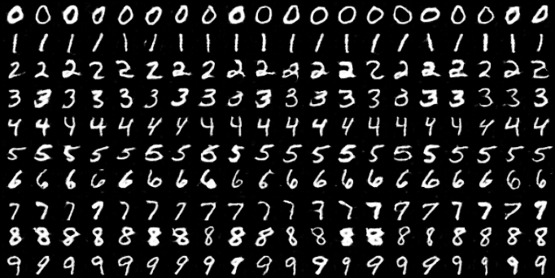
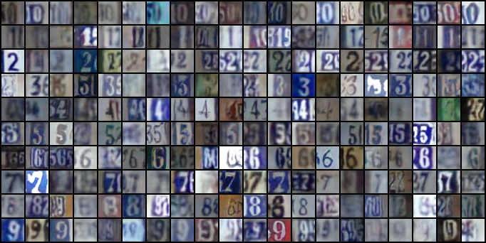
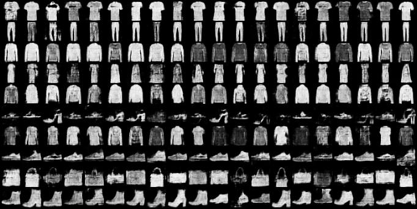
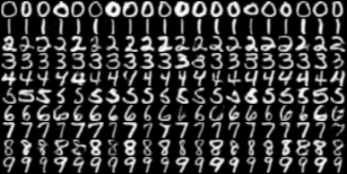

# Pytorch-cGAN-conditional-GAN
Pytorch implementation of conditional generative adversarial network (cGAN) using DCGAN architecture for generating 32x32 images of MNIST, SVHN, FashionMNIST, and USPS datasets.
 

## Run commands (also available in <a href="scripts.sh">scripts.sh</a>):  

<table>
  <tr>
    <th>Dataset</th>
    <th>Run command</th>
  </tr>
  <tr>
    <td>MNIST</td>
    <td>python python main.py --dataset mnist --epochs 10</td>
  </tr>
  <tr>
    <td>Fashion MNIST</td>
    <td>python main.py --dataset fashionmnist --epochs 50</td>
  </tr>
  <tr>
    <td>SVHN</td>
    <td>python main.py --dataset svhn --epochs 100 --n_channels 3</td>
  </tr>
  <tr>
    <td>USPS</td>
    <td>python main.py --dataset usps --epochs 100</td>
  </tr>
</table>

 

## Generated Samples 
#### MNIST
</img>
#### SVHN
</img>
#### FashionMNIST
</img>
#### USPS
</img>
