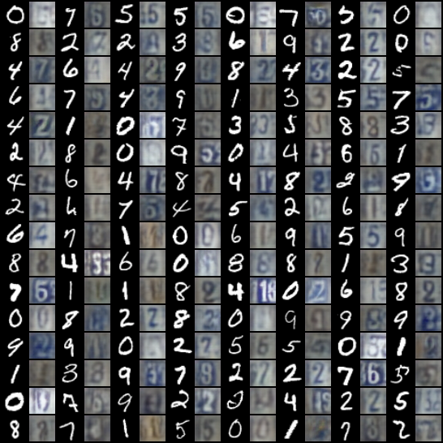
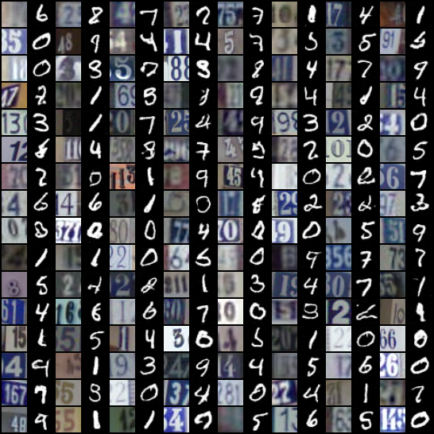
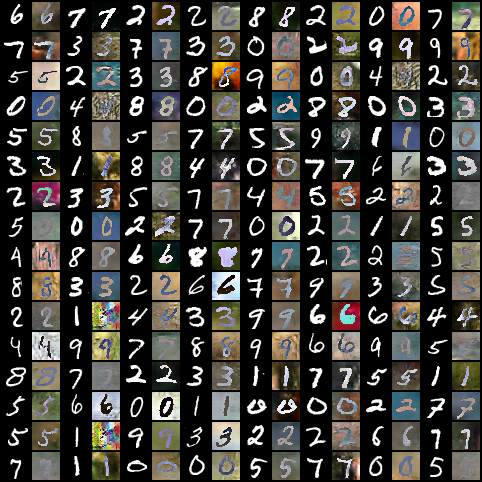
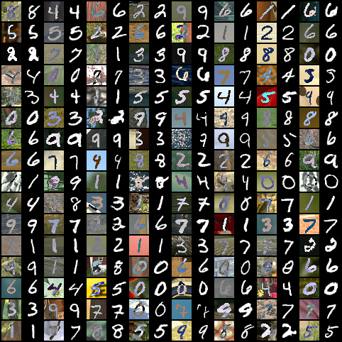
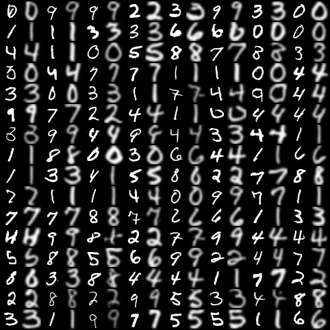
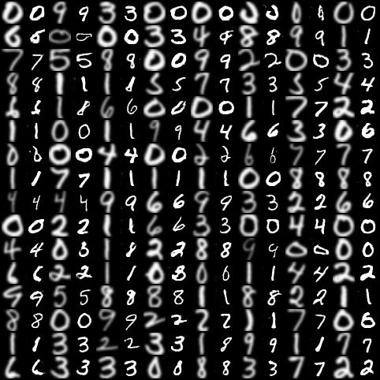
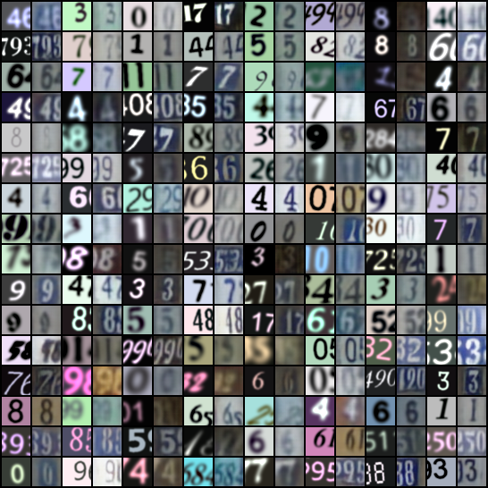
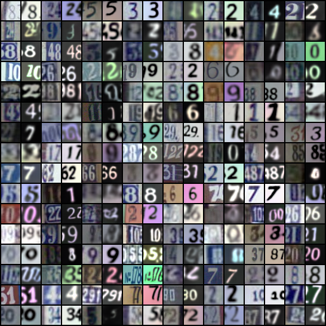

# Pytorch-CycleGAN-Digits
Unofficial Pytorch implementation of [CycleGAN](https://arxiv.org/abs/1703.10593) for MNIST, USPS, SVHN, MNIST-M and SyntheticDigits datasets.

 

Change the DS variables to change the dataset.
For using the saved model to generate images, set LOAD_MODEL to True and EPOCHS to 0.
## Generated Samples
### MNIST &#10231; SVHN
MNIST &#10230; SVHN             |  SVHN &#10230; MNIST
:-------------------------:|:-------------------------:
  |  

### MNIST &#10231; MNIST-M
MNIST &#10230; MNIST-M             |  MNIST-M &#10230; MNIST
:-------------------------:|:-------------------------:
  |  

### MNIST &#10231; USPS
MNIST &#10230; USPS             |  USPS &#10230; MNIST
:-------------------------:|:-------------------------:
  |  

### SyDigits &#10231; SVHN
SyDigits &#10230; SVHN             |  SVHN &#10230; SyDigits
:-------------------------:|:-------------------------:
  |  
