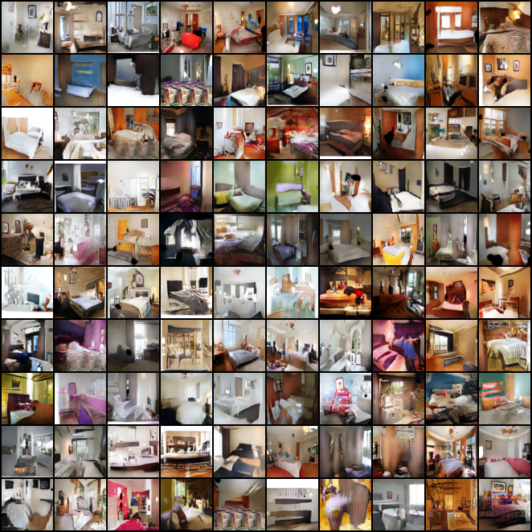
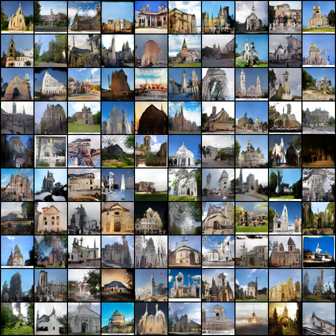
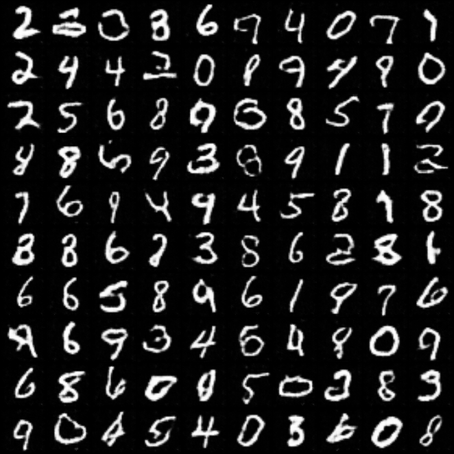
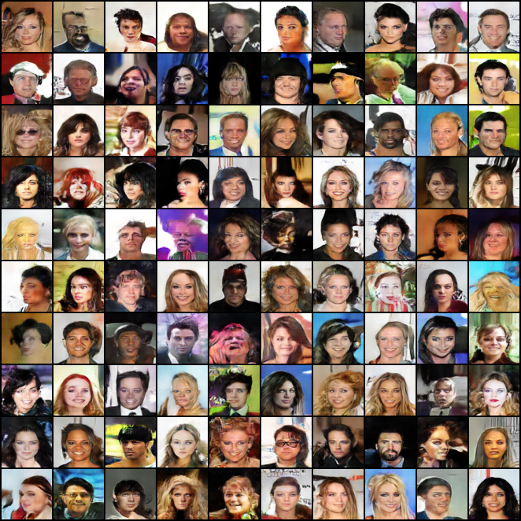

# Pytorch-DCGAN
Pytorch implementation of [DCGAN](https://arxiv.org/abs/1511.06434) for generating 64x64 images.

### LSUN Dataset
To download LSUN dataset follow the steps at [https://github.com/fyu/lsun](https://github.com/fyu/lsun)

 
## Run commands (also available in <a href="./scripts.sh">scripts.sh</a>):  

<table>
  <tr>
    <th>Dataset</th>
    <th>Run command</th>
  </tr>
  <tr>
    <td>MNIST</td>
    <td>python main.py --dataset mnist --n_channels 1 --epochs 25</td>
  </tr>
  <tr>
    <td>CelebA</td>
    <td>python main.py --dataset celeba</td>
  </tr>
  <tr>
    <td>LSUN Church</td>
    <td>python main.py --dataset lsun_church</td>
  </tr>
  <tr>
    <td>LSUN Bedroom</td>
    <td>python main.py --dataset lsun_bedroom</td>
  </tr>
</table>

## Generated Samples
#### LSUN-Bedroom
</img>
#### LSUN-Church
</img>
#### MNIST
</img>
#### CelebA
</img>
