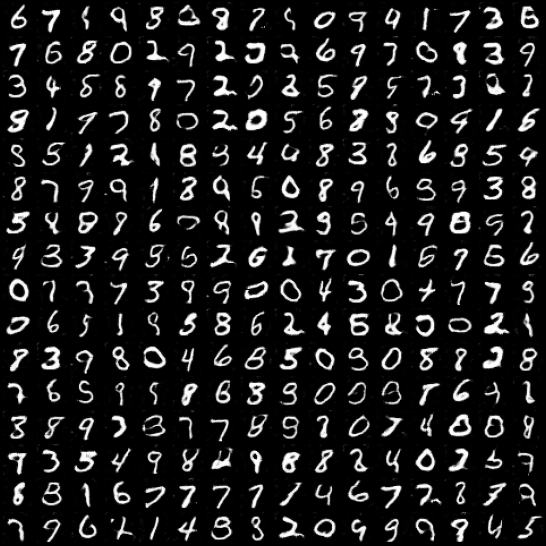
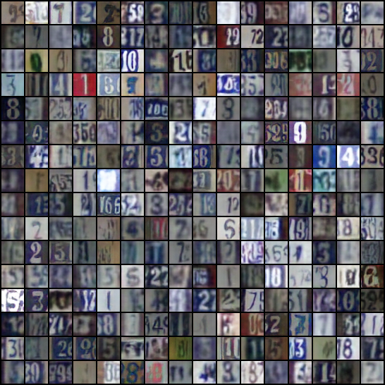
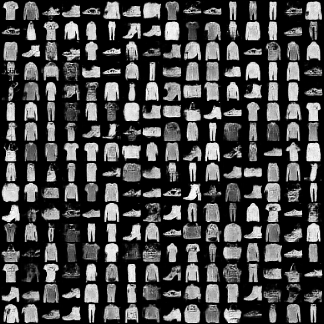
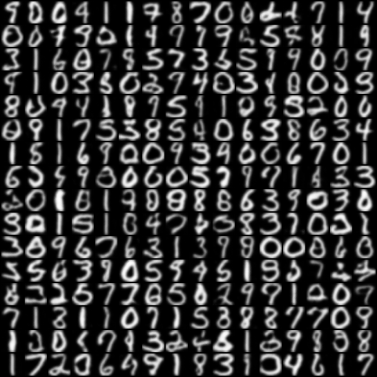
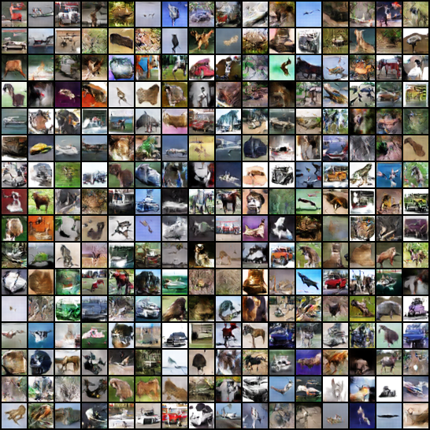

# Pytorch-DCGAN32
Pytorch implementation of DCGAN for generating 32x32 images of SVHN, CIFAR10, MNIST, FashionMNIST, and USPS dataset.

## Run commands (also available in <a href="scripts.sh">scripts.sh</a>):  

<table>
  <tr>
    <th>Dataset</th>
    <th>Run command</th>
  </tr>
  <tr>
    <td>MNIST</td>
    <td>python main.py --dataset mnist        --epochs 25  --n_channels 1</td>
  </tr>
  <tr>
    <td>Fashion MNIST</td>
    <td>python main.py --dataset fashionmnist --epochs 50  --n_channels 1</td>
  </tr>
  <tr>
    <td>SVHN</td>
    <td>python main.py --dataset svhn         --epochs 100 --n_channels 3</td>
  </tr>
  <tr>
    <td>USPS</td>
    <td>python main.py --dataset usps       --epochs 100 --n_channels 1</td>
  </tr>
  <tr>
    <td>CIFAR10</td>
    <td>python main.py --dataset cifar10       --epochs 200 --n_channels 1</td>
  </tr>
</table>

 

## Generated Samples
#### MNIST
</img>
#### SVHN
</img>
#### FashionMNIST
</img>
#### USPS
</img>
#### CIFAR10
</img>
