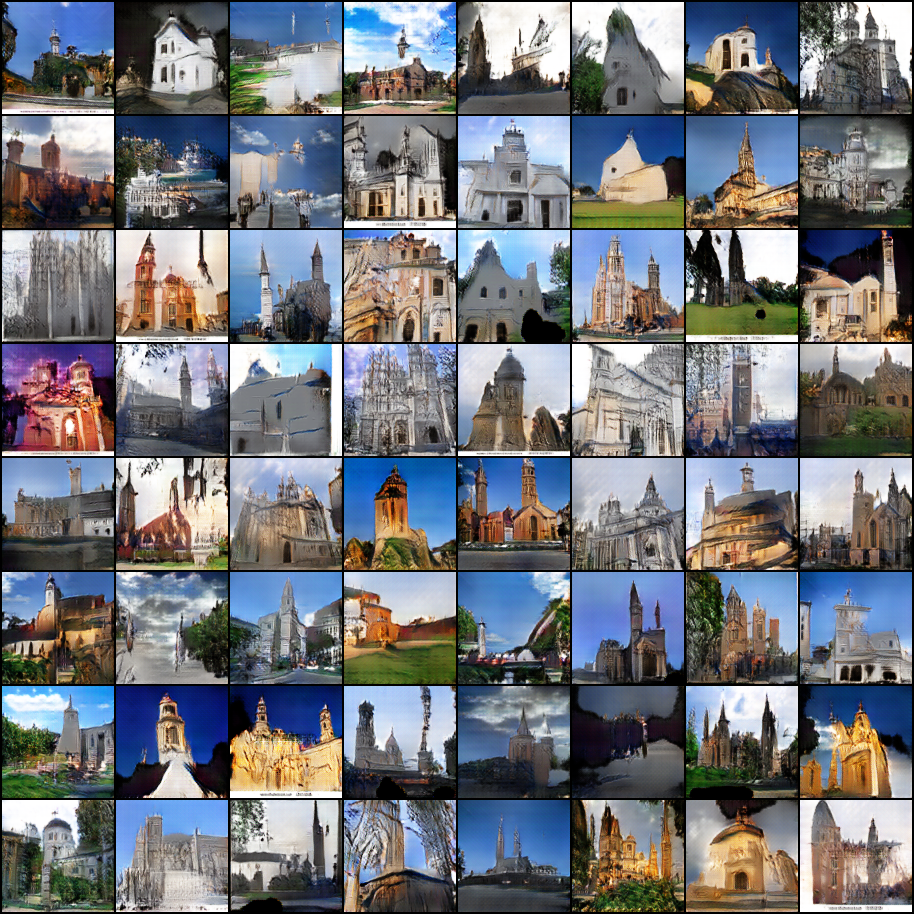
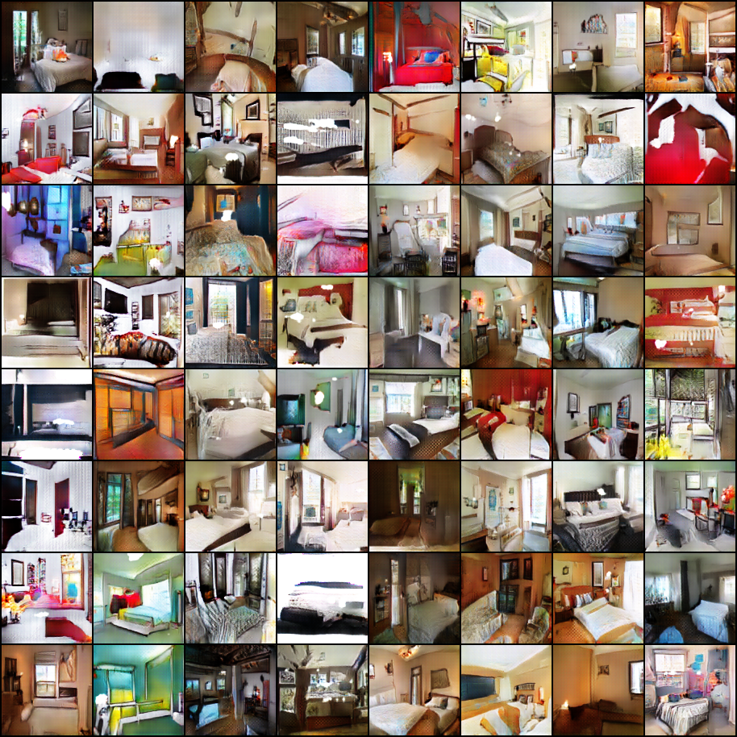
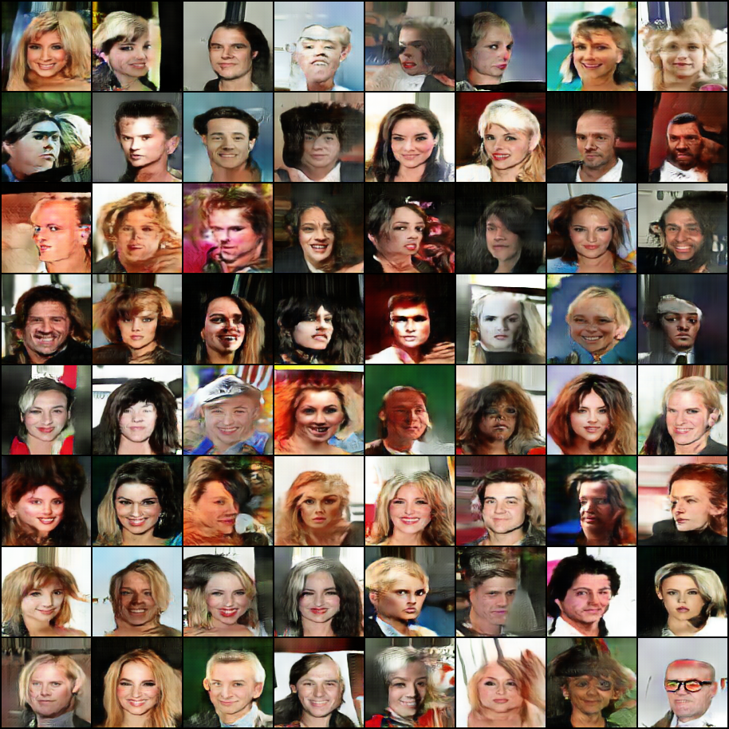

# Pytorch-LSGAN
Unofficial pytorch implementation of [Least Squares Generative Adversarial Networks (LSGAN)](https://arxiv.org/abs/1611.04076)  for generating 112x112 images.

### LSUN Dataset
To download LSUN dataset follow the steps at [https://github.com/fyu/lsun](https://github.com/fyu/lsun)

 
Change the DB variable to change the dataset.

For using the saved model to generate images, set LOAD_MODEL to True and EPOCHS to 0.

## Generated Samples
#### LSUN-Church
</img>
#### LSUN-Bedroom
</img>
#### CelebA
</img>