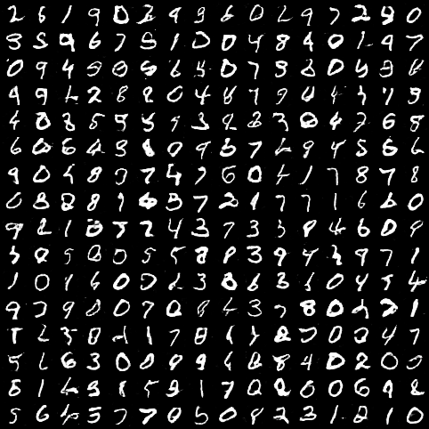
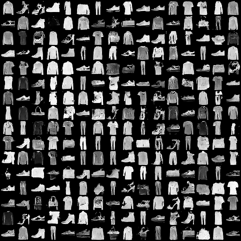

# Pytorch-LSGAN-MNIST
Pytorch implementation of LSGAN for generating MNIST images.

 

## Run commands (also available in <a href="scripts.sh">scripts.sh</a>):  

<table>
  <tr>
    <th>Dataset</th>
    <th>Run command</th>
  </tr>
  <tr>
    <td>MNIST</td>
    <td>python main.py --dataset mnist 		  --epochs 50</td>
  </tr>
  <tr>
    <td>Fashion MNIST</td>
    <td>python main.py --dataset fashionmnist  --epochs 100</td>
  </tr>
  <tr>
    <td>USPS</td>
    <td>python main.py --dataset usps --epochs 100  --image_size 16</td>
  </tr>
</table>

 

## Generated Samples
#### MNIST
</img>
#### FashionMNIST
</img>