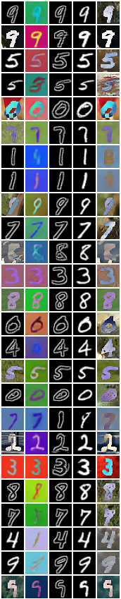
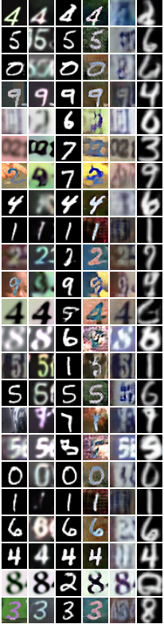

# Pytorch-StarGAN-Digits
Unofficial Pytorch implementation of StarGAN for generating Digits.

 

## Run command
python main.py --datasets mnist cmnist emnist usps

Add datasets to be included as part of the model.

 

## Generated Samples
| MNISTs | Digits |
| --- | --- |
</img> | </img>

