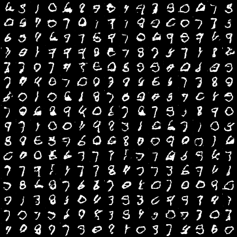
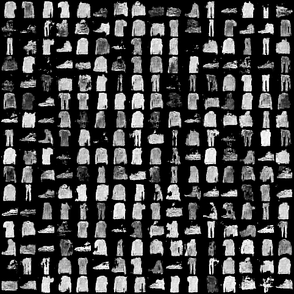
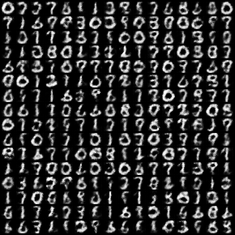

# Pytorch-Tiny GAN
Pytorch implementation of a small GAN network for MNIST, FashionMNIST, and USPS datasets.

### Parameters
Image Size | Generator | Discriminator
--- | --- | ---
28x28 | 6,897 | 3,001
16x16 | 3,729 | 2,473

 

## Run commands (also available in <a href="scripts.sh">scripts.sh</a>):  

<table>
  <tr>
    <th>Dataset</th>
    <th>Run command</th>
  </tr>
  <tr>
    <td>MNIST</td>
    <td>python main.py --dataset mnist</td>
  </tr>
  <tr>
    <td>Fashion MNIST</td>
    <td>python main.py --dataset fashionmnist</td>
  </tr>
  <tr>
    <td>USPS</td>
    <td>python main.py --dataset usps  --image_size 16</td>
  </tr>
</table>

 

## Generated Samples
#### MNIST
</img>
#### FashionMNIST
</img>
#### USPS
</img>
