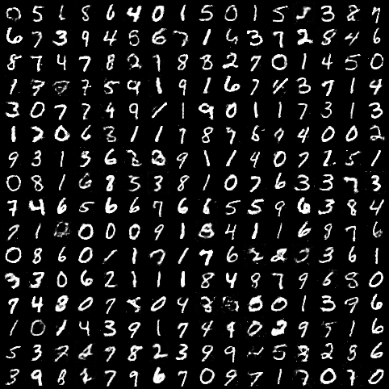
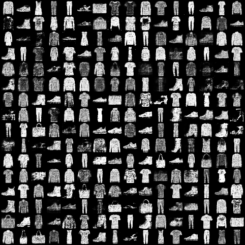
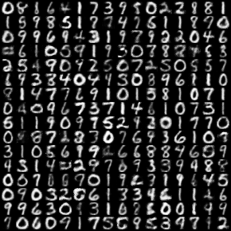

# Pytorch-Vanilla-GAN
Pytorch implementation of Vanilla-GAN for MNIST, FashionMNIST and USPS dataset.

### Generator
FC(10)&#x2192;FC(1024)&#x2192;FC(1024)&#x2192;FC(Image_Size)
### Discriminator
FC(Image_Size)&#x2192;FC(256)&#x2192;FC(256)&#x2192;FC(1)

## Run commands (also available in <a href="scripts.sh">scripts.sh</a>):  

<table>
  <tr>
    <th>Dataset</th>
    <th>Run command</th>
  </tr>
  <tr>
    <td>MNIST</td>
    <td>python main.py --dataset mnist</td>
  </tr>
  <tr>
    <td>Fashion MNIST</td>
    <td>python main.py --dataset fashionmnist</td>
  </tr>
  <tr>
    <td>USPS</td>
    <td>python main.py --dataset usps  --image_size 16</td>
  </tr>
</table>

 

## Generated Samples
#### MNIST
</img>
#### FashionMNIST
</img>
#### USPS
</img>