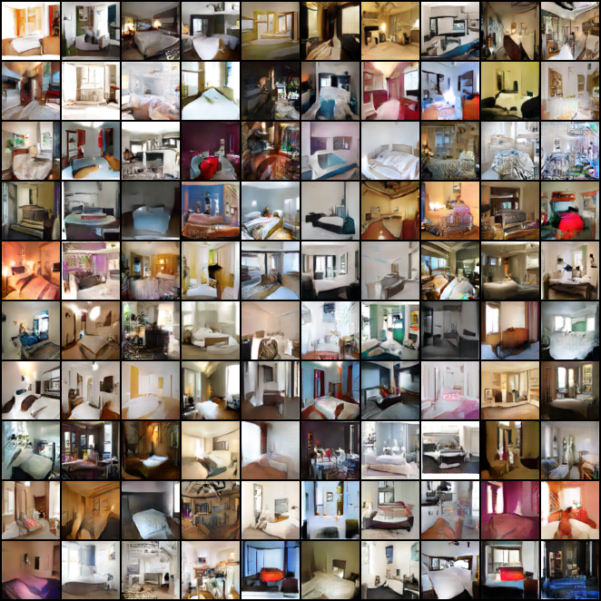
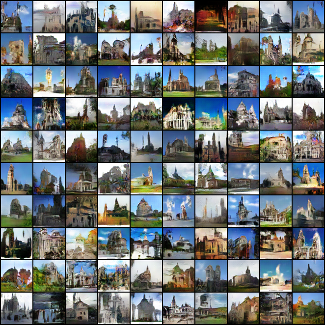
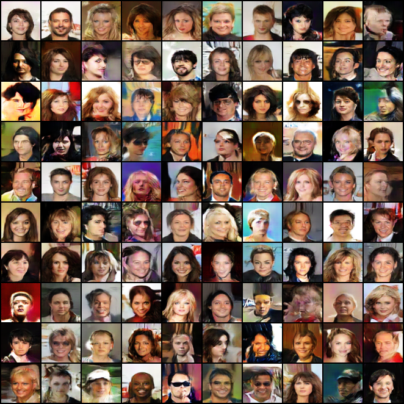

# Pytorch-WGANGP
Pytorch implementation of [Improved Training of Wasserstein GANs](https://arxiv.org/abs/1704.00028) or WGAN-GP (Wasserstein GAN with Gradient Penalty) using DCGAN architecture for generating 64x64 images.

### LSUN Dataset
To download LSUN dataset follow the steps at [https://github.com/fyu/lsun](https://github.com/fyu/lsun)

 
Change the DB variable to change the dataset.

For using the saved model to generate images, set LOAD_MODEL to True and EPOCHS to 0.

## Generated Samples
#### LSUN-Bedroom
</img>
#### LSUN-Church
</img>
#### CelebA
</img>
